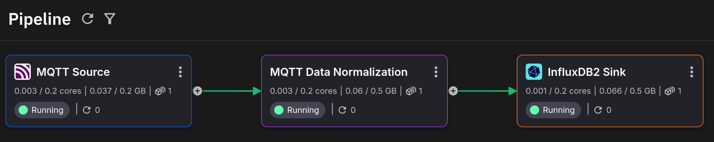
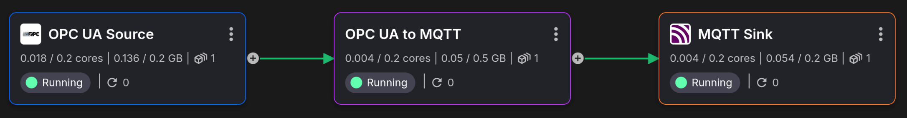
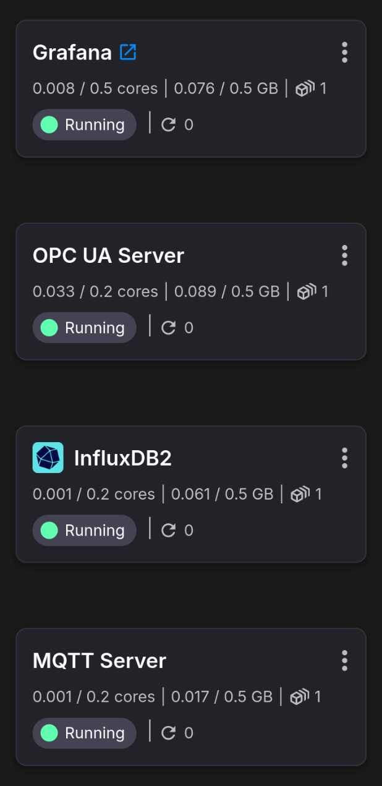
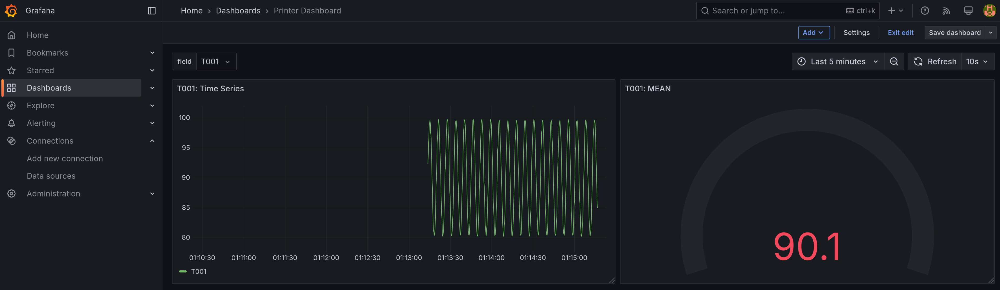

# Simple MQTT Ingestion Project Template

This example project demonstrates how to retrieve data from an MQTT broker, 
do some normalizations, and then publish the augmented data to an InfluxDB2 database.

It also includes visualization/dashboard examples using Grafana (which queries InfluxDB2).

## Running the Template

### Syncing
Once the project is set up, an initial sync must be performed to deploy everything. 

Essentially, the cloud state must sync up to the current state of the new repository 
which now has a cloned version of the template.


Syncing is always a manually initiated operation that's available whenever updates 
to the code (underlying repository) happen.

### Setting Secrets

>**WARNING**: These secrets exist to act as an authentication layer since 
> ***some services are openly accessible to the entire internet***;
> as such: **DO NOT PICK WEAK PASSWORDS**.

Upon syncing, there will be a prompt to set up some project-level secrets (passwords). 
Simply choose a secure password for each.


Note that once set, you cannot view the values again. This largely only matters for 
services like Grafana, where users will be required to directly enter them for access to 
the UI. Other services will reference these secrets directly in their project deployment 
configurations.

## Project Architecture

### MQTT Ingestion Pipeline

This is the MQTT-based data ingestion portion of the project:




### Mock Data Source

These applications are only meant to put our sample data in an MQTT broker:




### Standalone Services

These are standalone services, including an InfluxDB2 instance.




## Configuration

There are various things that can be tweaked, like the name of the InfluxDB database. 
However, everything in this template has predefined values except secrets, which will
require defining upon deployment of this project (see 
[setting secrets](#setting-secrets) for more info).


## Data Operations Overview

### Event Structure
```json
{
  "srv_ts": 1753717885782747100,
  "connector_ts": 1753717885792584200,
  "type": "Double",
  "val": 198.54935414815827,
  "param": "T002",
  "machine": "3D_PRINTER_2"
}
```

The MQTT source will receive IoT events from a sensor (`machine`) that each contain a 
value (`val`) for a given measurement (`param`), along with the timestamp it was 
generated at (`srv_ts`).

In total, there are 2 different parameters: `T001` and `T002`.

In this example, there is only 1 machine (`3D_PRINTER_2`).


### Normalizing Events

We will normalize these events so that each parameter is no longer an individual event.

Instead, we aggregate across all parameters so that for a given machine, we get the 
average of each parameter across 1 second (determined by the event timestamp, `srv_ts`).

This will result in a new outgoing aggregate event:

```json
{
  "T001": 97.20,
  "machine": "3D_PRINTER_2",
  "T002": 194.41,
  "timestamp": "2025-07-28 15:52:51.600000"
}
```

This aggregation is done using a Quix Streams `tumbling_window` operation, found in the
`MQTT Data Normalization` application.


### InfluxDB2 Data

These events are then pushed to InfluxDB2 to database `my_bucket` under measurement 
`printers` (with `machine` as a tag).


**my_bucket**: **printers**

| T001  | T002   | timestamp (_time)            | machine (_tag)   |
|-------|--------|------------------------------|------------------|
| 97.20 | 194.41 | "2025-07-28 15:52:51.600000" | "3D_PRINTER_2"   |


## Grafana

There is a simple Grafana dashboard included in the project.

You can select which column to view (`T001`, `T002`) for the given graphs.

There is a simple Time Series graph and mean value gauge, each based on the 
selected time window.

